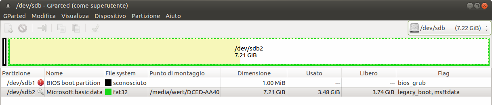

http://mbusb.aguslr.com/

http://www.slivermetal.org/2016/09/18/how-to-create-an-hybrid-uefi-gpt-bios-gptmbr-boot-usb-disk/

https://github.com/thias/glim

makeUSB.sh will create for you a hybrid uefi gpt bios gptmbr boot disk like the example in the picture

git clone https://github.com/aguslr/multibootusb.git
cd multibootusb

bash makeUSB.sh /dev/sdb

then put isos in its /boot/iso folder

